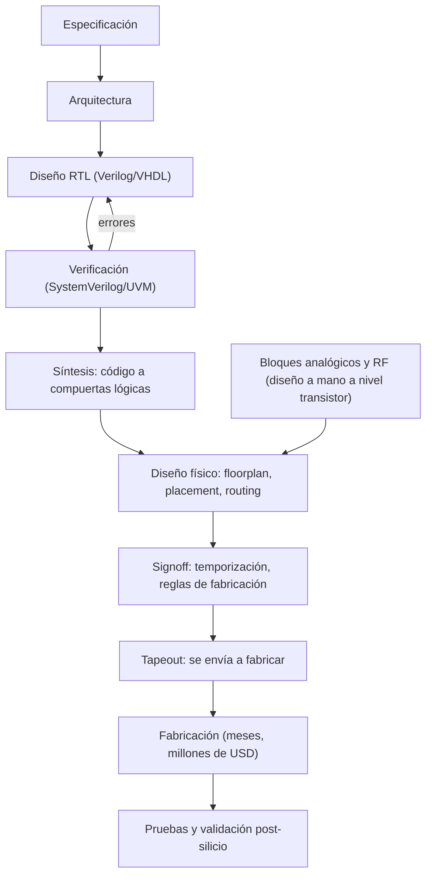
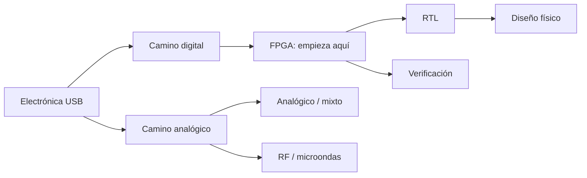

# Introducción al diseño de chips

Una guía desde cero para entender qué hace cada especialidad, cómo se relacionan entre sí y por dónde empezar.

---

## 0. La idea general: ¿cómo nace un chip?

Un chip moderno (un procesador, el chip de WiFi de tu teléfono, una GPU) tiene **miles de millones de transistores**. Nadie los dibuja uno por uno. El proceso se parece a construir un edificio:

| Edificio | Chip |
|---|---|
| El cliente dice qué quiere | **Especificación**: "un procesador que haga X a 2 GHz consumiendo Y watts" |
| El arquitecto hace los planos funcionales | **Arquitectura y diseño RTL**: se describe la lógica en código |
| Los inspectores revisan los planos antes de construir | **Verificación**: se demuestra que el diseño hace lo que debe |
| El ingeniero civil decide dónde va cada viga y tubería | **Diseño físico**: se ubica cada transistor y cable en el silicio |
| La constructora construye | **Fábrica (foundry)**: TSMC, Samsung, Intel, GlobalFoundries |
| Se inspecciona el edificio terminado | **Validación post-silicio y pruebas** |



> [!IMPORTANT]
> **Por qué esta industria valora tanto a los ingenieros:** fabricar un chip en una tecnología avanzada puede costar decenas de millones de dólares y tarda meses. Si hay un error, se pierde todo ese dinero y tiempo. Por eso nadie le entrega el diseño a una IA sin expertos que lo revisen.

Hay dos mundos dentro del chip:
- **Digital**: ceros y unos. Se diseña con código y está muy automatizado. Incluye RTL, verificación, diseño físico y FPGA.
- **Analógico**: voltajes y corrientes continuos, el mundo real. Se diseña casi a mano. Incluye analógico/mixto y RF.

---

## 1. Diseño digital (RTL)

**RTL** significa *Register Transfer Level* (nivel de transferencia entre registros).

### Qué es
Describes con **código** cómo debe comportarse el circuito digital: registros, sumadores, máquinas de estados, buses. Parece programación, pero **no lo es**. No describes pasos que se ejecutan uno tras otro: describes **hardware que existe y funciona todo al mismo tiempo**.

Es lo mismo que haces en Sistemas Digitales con compuertas y flip-flops, pero a gran escala y escrito en texto en vez de dibujado.

### Ejemplo: un contador de 4 bits en Verilog
```verilog
module contador (
  input  wire       clk,    // reloj
  input  wire       rst,    // reset
  output reg  [3:0] cuenta  // salida de 4 bits (0 a 15)
);
  always @(posedge clk) begin   // en cada flanco de subida del reloj...
    if (rst) cuenta <= 4'd0;     // ...si hay reset, vuelve a 0
    else     cuenta <= cuenta + 4'd1; // ...si no, suma 1
  end
endmodule
```
Este código **no se ejecuta**: se convierte (*sintetiza*) en 4 flip-flops y un sumador reales.

### Qué necesitas saber
- Lógica digital: compuertas, flip-flops, máquinas de estados.
- Verilog / SystemVerilog o VHDL.
- Arquitectura de computadores: pipelines, memorias caché, buses.
- Conceptos de temporización: reloj, *setup* y *hold*.

### Lenguajes
- **Verilog / SystemVerilog**: el estándar en la industria, sobre todo en EE. UU. y Asia.
- **VHDL**: muy usado en Europa, en la industria aeroespacial y en defensa.

---

## 2. Verificación (SystemVerilog / UVM)

### Qué es
Tu trabajo es **intentar romper el diseño** antes de fabricarlo. Escribes programas de prueba (*testbenches*) que bombardean el diseño con millones de casos, y compruebas que siempre responde bien.

> [!NOTE]
> Se estima que en un chip moderno **más de la mitad del esfuerzo** de ingeniería se va en verificación. Suele haber más ingenieros de verificación que diseñadores. Por eso es la puerta de entrada más fácil a la industria.

### Técnicas principales
- **Testbench**: el "laboratorio virtual" que estimula al diseño y revisa sus respuestas.
- **Estímulos aleatorios con restricciones**: en vez de probar 10 casos a mano, generas millones de casos aleatorios pero válidos.
- **Cobertura (coverage)**: mide qué porcentaje de las situaciones posibles ya probaste.
- **Aserciones**: reglas que deben cumplirse siempre. Si alguna falla, saltan las alarmas.
- **UVM** (*Universal Verification Methodology*): una metodología estándar, con su librería de clases en SystemVerilog, para organizar testbenches grandes y reutilizables. Es lo que piden las ofertas de empleo.

### Ejemplo: una aserción
"Cuando el contador llega a 15, en el siguiente ciclo debe volver a 0":
```systemverilog
property vuelve_a_cero;
  @(posedge clk) disable iff (rst)
    (cuenta == 4'd15) |=> (cuenta == 4'd0);
endproperty

assert property (vuelve_a_cero)
  else $error("El contador no volvió a 0 después de 15");
```

### Qué necesitas saber
- Todo lo de RTL, para entender lo que verificas.
- SystemVerilog orientado a objetos (clases, herencia), parecido a Java o C++.
- UVM.
- Una mentalidad de "detective" que busca dónde puede fallar algo.

---

## 3. Diseño físico (*physical design*)

### Qué es
Toma el circuito ya sintetizado (millones de compuertas conectadas) y decide **dónde va físicamente cada una en el silicio y por dónde pasa cada cable**. Es como planificar una ciudad con miles de millones de casas y calles en unos pocos milímetros cuadrados.

### Etapas
1. **Floorplanning**: se reparte el espacio, decidiendo dónde van los grandes bloques, las memorias y los pines.
2. **Red de alimentación**: se lleva la energía a todos los rincones del chip sin caídas de voltaje.
3. **Placement**: se ubican las compuertas.
4. **Clock tree synthesis (CTS)**: se distribuye el reloj para que llegue a todos los flip-flops casi al mismo tiempo.
5. **Routing**: se trazan los cables por más de 10 capas de metal.
6. **Timing closure**: se garantiza que las señales lleguen a tiempo a la frecuencia objetivo. Esto se comprueba con análisis estático de temporización (**STA**).
7. **Signoff**: se verifican las reglas de fabricación (**DRC**) y que el layout coincida con el circuito (**LVS**).

### Qué necesitas saber
- Circuitos digitales y una idea de cómo funciona un transistor CMOS.
- Temporización (*setup*, *hold*, *slack*), consumo de potencia, retardos de los cables.
- Scripting en **TCL** y Python, porque todo se automatiza con scripts.
- Herramientas: Cadence Innovus, Synopsys Fusion Compiler (comerciales); OpenROAD y OpenLane (libres).

---

## 4. Diseño analógico y de señal mixta

### Qué es
El mundo real es analógico: sonido, temperatura, señales de radio, voltaje de una batería. Todo chip necesita bloques que **conecten el mundo real con el digital** o que manejen energía. Esos bloques se diseñan **transistor por transistor**, con mucha intuición física.

### Bloques típicos
| Bloque | Para qué sirve |
|---|---|
| **Amplificador operacional** | Amplificar señales débiles, como las de un sensor o un micrófono |
| **ADC** (conversor analógico-digital) | Convertir una señal real en números. Está en cámaras, micrófonos y sensores. |
| **DAC** (conversor digital-analógico) | Lo contrario, por ejemplo para generar audio |
| **PLL** (*phase-locked loop*) | Generar el reloj de GHz que usa el procesador a partir de un cristal lento |
| **Reguladores (LDO, DC-DC)** | Gestión de energía: dar voltajes estables a cada parte del chip |
| **Referencias de voltaje (bandgap)** | Un voltaje que no cambia con la temperatura |

**Señal mixta** significa un chip que combina partes analógicas y digitales, por ejemplo un ADC con su lógica de control.

### Por qué está tan bien pagado
- **No se puede automatizar bien.** Cada diseño es un equilibrio entre ruido, consumo, velocidad, área y variación de fabricación, y depende mucho de la experiencia.
- Formar a un buen diseñador analógico lleva años.
- Hay pocos en el mundo, y todos los chips los necesitan.

### Qué necesitas saber
- **Circuitos electrónicos** a fondo: transistores MOSFET, polarización, pequeña señal, realimentación, respuesta en frecuencia, estabilidad.
- Ruido, adaptación (*matching*) y efectos de fabricación.
- Simulación **SPICE**.
- **Layout analógico**: dibujar los transistores a mano con cuidado, porque la geometría afecta al rendimiento.
- Herramientas: Cadence Virtuoso (comercial); Xschem, ngspice, Magic y KLayout (libres).

> [!TIP]
> Si en la universidad te gustaron **Circuitos Electrónicos** y entender de verdad por qué un transistor amplifica, este es tu camino. Es el que más depende de entender la física y el que menos depende del código.

---

## 5. RF / microondas

### Qué es
Diseño de circuitos que trabajan a **frecuencias de radio**, desde cientos de MHz hasta decenas o cientos de GHz: WiFi, Bluetooth, 5G, GPS, radar de autos y satélites.

A esas frecuencias **los cables dejan de comportarse como cables**: son líneas de transmisión, hay reflexiones, todo radia y cada milímetro importa. Es la teoría electromagnética que viste (o verás) en Campos y Ondas, aplicada.

### Bloques típicos
- **LNA** (amplificador de bajo ruido): amplifica la señal débil que llega de la antena.
- **Mezcladores**: bajan o suben la frecuencia de la señal.
- **Osciladores (VCO)**: generan la portadora.
- **PA** (amplificador de potencia): da potencia a la señal antes de la antena.
- **Filtros y antenas**.

### Qué necesitas saber
- Electromagnetismo, líneas de transmisión, parámetros S, carta de Smith, adaptación de impedancias.
- Circuitos analógicos, porque RF es "analógico a alta frecuencia".
- Herramientas: Keysight ADS, Cadence (diseño en chip); simuladores electromagnéticos como HFSS o CST.
- Laboratorio: analizador de redes y analizador de espectro.

RF existe **dentro de los chips** (RFIC) y también **en tarjetas y sistemas** (diseño de PCB de RF, antenas, radar). Este segundo campo tiene más puertas de entrada.

---

## 6. FPGA

### Qué es
Una **FPGA** (*Field-Programmable Gate Array*) es un chip lleno de bloques lógicos y conexiones **que puedes reconfigurar**. Escribes Verilog o VHDL, igual que para un chip, y en vez de mandarlo a fabricar (meses y millones) **lo cargas en la FPGA en segundos**.

Es como tener un "chip de plastilina": puedes darle la forma de cualquier circuito digital, una y otra vez.

### Para qué se usa
- **Prototipar chips** antes de fabricarlos.
- Productos que se fabrican en pocas unidades, donde un chip propio no se justifica: equipos médicos, de telecomunicaciones, militares, aeroespaciales o de laboratorio.
- Procesamiento de señales en tiempo real: radar, video, comunicaciones.
- Trading de alta frecuencia y aceleración de cálculos.

### Por qué es buena para empezar
- **Es barata.** Placas como la Tang Nano 9K cuestan alrededor de 20–30 USD, y una Basys 3 o una DE10-Lite, alrededor de 100–200 USD.
- Ves tu hardware funcionando de verdad: LEDs, pantallas, motores, VGA.
- Usa el mismo lenguaje que el diseño de chips, así que lo que aprendes te sirve directamente para RTL y verificación.
- Hay trabajo **remoto** como freelance.

### Fabricantes
AMD (antes Xilinx), Altera (antes de Intel), Lattice, Gowin, Microchip.

---

## 7. Resumen: ¿cuál es para ti?

| Si te gusta... | Especialidad |
|---|---|
| Sistemas Digitales, la lógica, programar | **RTL** o **FPGA** |
| Encontrar errores, pensar en casos raros, programar en serio (orientado a objetos) | **Verificación** |
| Optimizar, resolver rompecabezas, automatizar con scripts | **Diseño físico** |
| Circuitos Electrónicos, entender transistores a fondo, la física | **Analógico / mixto** |
| Campos y Ondas, antenas, telecomunicaciones | **RF / microondas** |



---

## 8. Ruta para empezar (gratis o casi gratis)

### Fase 1: digital y FPGA (1–3 meses)
1. **[Nandgame](https://nandgame.com)**: construye una computadora desde compuertas NAND. Es divertido y aclara las bases.
2. **[HDLBits](https://hdlbits.01xz.net)**: cientos de ejercicios de Verilog corregidos automáticamente en el navegador. El mejor recurso para empezar.
3. Libro: *Digital Design and Computer Architecture*, de Harris & Harris.
4. Compra una FPGA barata (Tang Nano 9K) y haz proyectos: contador en displays, UART, salida VGA, un procesador sencillo.

### Fase 2: elige una rama
- **Verificación**: [ChipVerify](https://www.chipverify.com) y [Verification Academy](https://verificationacademy.com) (de Siemens, gratis).
- **Diseño físico y chip completo**: [Tiny Tapeout](https://tinytapeout.com). Diseñas un mini chip que **se fabrica de verdad** por poco dinero. Usa herramientas libres (OpenLane / OpenROAD).
- **Analógico**: las clases de **Behzad Razavi** en YouTube (gratis, excelentes) y su libro *Design of Analog CMOS Integrated Circuits*. Practica con Xschem y ngspice.
- **RF**: libro *Microwave Engineering*, de Pozar, y *RF Microelectronics*, de Razavi.

### Fase 3: portafolio
- Sube tus proyectos a **GitHub** con buena documentación.
- Un chip de Tiny Tapeout o un procesador RISC-V en FPGA en tu CV llama mucho la atención en las solicitudes de máster y en las entrevistas.

> [!TIP]
> **Cómo usar la IA aquí:** pídele que te explique conceptos, que revise tu Verilog o que te proponga ejercicios. Pero ten cuidado: la IA se equivoca bastante más en Verilog, en analógico y en RF que en programación web. **Comprueba siempre simulando.** El simulador no miente.
